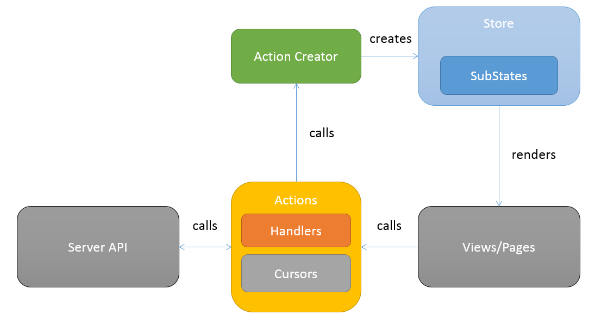

# Bobflux
* is pure functional implementation of FLUX architecture
* is inspired by [Flux](https://facebook.github.io/flux/docs/overview.html#content), [Reflux](https://github.com/spoike/refluxjs) and [Redux](https://github.com/gaearon/redux)
* fits and depends on [Bobril](https://github.com/Bobris/Bobril)

## Installation
```
npm i bobflux --save
```

## How to run example through [bobril-build](https://github.com/Bobris/bobril-build)
```
npm install bobril-build -g

bb
```

## Fun-model
* is core of bobflux,
* is independent on bobril, can be used for React applications,
* there is [fun-model](https://github.com/karelsteinmetz/fun-model/blob/master/README.md) you can see some notes about flux, immutability etc.

## Common keywords in Bobflux application
* one store for one application state
* application state:
 * is global state
 * is composition of sub states
 * actions are create by action factory with specified cursor and handler. Handler creates new instance of state or it can return the same state
* Bobril is here for "rendering" (View)
* Bobril component context (b.IBobrilCtx) should be used for intermediate state (drag & drop, input border color on focus etc.)

## Livecycle
 

### Getting started video [cz] 
[](http://www.youtube.com/watch?v=8p27FLAneiM)

## State
* is object
* is global state of application
* one instance is held in store
* default state must be set before firts usage

```js
//state.ts
import * as f from 'bobflux';

export interface ITodo {
    id: number;
    isDone: boolean;
    name: string;
}

export interface ITodosState extends f.IState {
    editedTodo: ITodo;
    todos: ITodo[];
}
```

```js
//app.ts - main application file in bobril-build or systemjs
import * as f from 'bobflux';
import * as s from './states';

f.bootstrap(s.default());
```

## Views/Pages
* can be pure bobril components or can be created by bobflux

### Bobflux Components
* is derived component from Bobril
* gets state through cursor which has been specified in creation
* sets last state into component context
* offers state property in context (ctx.state)
* component should not have data
* all data should be passed by state
* why?
 * implements shouldChange and holds last state from last rendering
 * protects against useless rendering parts in your application
* there are two kinds of components:
 * component
   * is common component which has state in context
 * routeComponent
   * is fitted for bobril router and has state in context
   * is virtual component which wrappes bobflux component
   * bobflux component cannot be used in router beacause you can not specify cursor in route handler. Creation is invoked by router.
* if you operate with b.invalidate(ctx) in your component you can force shouldChange by ctx.forceShouldChange
 
```js
import * as b from 'bobril';
import * as gui from 'bobril-css-bootstrap';
import * as f from 'bobflux';
import * as s from './states';
import * as a from './actions';
import * as c from './cursors';

export let create = f.createRouteComponent<s.ITodosState, any>({
    render(ctx: f.IContext<s.ITodosState>, me: b.IBobrilNode, oldMe?: b.IBobrilCacheNode) {
        me.children = [
            addForm(c.editedTodo),
            table(c.todos)
        ]
    }
})

let addForm = f.createComponent<s.ITodo, any>({
    render(ctx: f.IContext<s.ITodo>, me: b.IBobrilNode, oldMe?: b.IBobrilCacheNode) {
        me.children = gui.form({
            isInlined: true,
            content: [
                gui.inputFormField('', ctx.state.name, a.updateNewTodoName),
                gui.button({ label: 'Add', onClick: () => { a.addTodo(); return true; } })
            ]
        })
    }
})
```
## Cursor
* has key which specifies path to target propery of objects or subobjects in global application state
* there are two kinds of cursors:
 * for maps - "all objects/classes" in js

```js
export let editedTodoName: f.ICursor<string> = {
    key: 'todoSection.editedTodo.name'
}

export let todos: f.ICursor<s.ITodo[]> = {
    key: 'todoSection.todos'
}
```

 * for array items with static cursor key

```js
export let firstTodo: f.ICursor<s.ITodo> = {
    key: 'todoSection.todos.0'
}

export let firstTodoName: f.ICursor<string> = {
    key: 'todoSection.todos.0.name'
}
```

 * for array items with dynamic cursor key

```js
export let todosIndexFactory: f.ICursorFactory<s.ITodo, number> = {
    create: (index) => {
        return { key: `todoSection.todos.${index}` };
    }    
}

export let todoNameThroghtIndexFactory: f.ICursorFactory<string, number> = {
    create: (index) => {
        return { key: `todoSection.todos.${index}.name` };
    }    
}
```

## Action
* returns new instances of modified state and its sub states
* beware on array operations like push etc.
* use as much as possible specific cursors
* if you want to modify more sub states then you should create two actions with specified cursors. Then invoke actions synchronously. b.invalidate waits for both actions. If actions take a long time then intermediate state will be rendered between actions.
* function should not be passed through parameters into action

### Common creation and invoking
* implementation:
```js
export let removeTodo = f.createAction<s.ITodo[], number>(c.todos, (todos, id) => {
    return [...todos.filter(t => t.id !== id)];
});
```
* invoking:
```js
actions.removeTodo(t.id);
```

### Without parameters
* implementation:
```js
export let removeTodoId1 = bobflux.createAction(cursors.todos, (todos: states.ITodo[]): states.ITodo[] => {
    return [...todos.filter(t => t.id !== 1)];
});
```
* invoking:
```js
actions.removeStaticTodo();
```

### If you need pass more parameters into action
* implementation:

```js
export interface IChangeDoneStatusParams {
    id: number;
    isDone: boolean;
}

export let changeDoneStatus = f.createAction<s.ITodo[], IChangeDoneStatusParams>(c.todos, (todos, params) => {
    return todos.map(t => {
        if (t.id === params.id)
            return f.shallowCopy(t, (nT) => {
                nT.isDone = params.isDone;
                return nT;
            });
        return t;
    })
});
```

* invoking:
```js
 actions.changeDoneStatus({ id: t.id, isDone: value })
```

### With cursor factory
* implementation:
```js
let testAction = af.createAction<tds.ITodo, tds.ITodoParams>(
    {
        create: (params) => {
            return { key: `todos.${params.index}` };
        }
    },
    (state, params) => { return params.todo }
);
```
* invoking:
```js
testAction({ index: 1, todo: { done: false, name: 'New second todo' } });
```


### Issues
* beware on invoking because params of actions are optional!!! Compiler cannot check this mistake.
